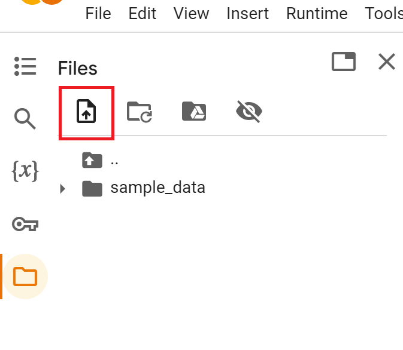
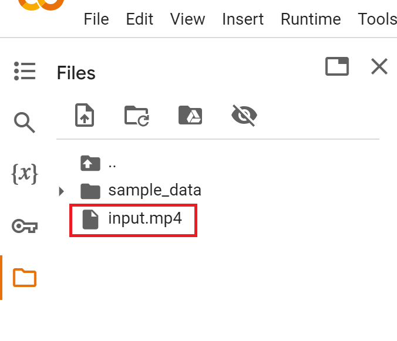
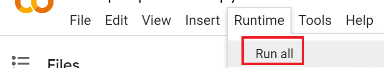

# Activitat: Experimentant amb OpenPose per a la Pose Estimation

## Objectius

- Utilitzar OpenPose, una IA per a la pose estimation, per analitzar vídeos o imatges.
- Comprendre com les tecnologies d'intel·ligència artificial com OpenPose poden detectar i seguir les posicions del cos humà.
- Provar diferents situacions i moviments per observar com respon OpenPose en escenaris variats.
- Reflexionar sobre els resultats obtinguts, analitzant la precisió i les limitacions de la detecció de posició.

## Introducció

OpenPose és una eina d'intel·ligència artificial que utilitza la tecnologia de pose estimation per identificar i seguir les posicions del cos en imatges o vídeos. Aquest tipus de tecnologia és àmpliament utilitzada en aplicacions com la conducció autònoma, la vigilància i la biomecànica per comprendre els moviments del cos humà.

En aquesta activitat, farem servir OpenPose a través de Google Colab amb el notebook proporcionat per a l'anàlisi de vídeos o imatges. Crearem vídeos nosaltres mateixos per provar la capacitat de detecció de OpenPose.

## Passos per a l'activitat

### Part 1

1. **Captura de vídeos o imatges:** Utilitza un dispositiu per capturar vídeos o imatges de tu mateix/a realitzant diferents moviments amb els braços i les cames o caminant a diferents distàncies de la càmera.

Els vídeos o imatges que capturis t'han d'ajudar a poder respondre les preguntes de reflexió. Per tant hauries d'incorporar els següents comportaments o les següents accions:

1. **Provoca variacions en la distància:** Intenta col·locar-te a diferents distàncies de la càmera ja que potser no detecta totes les articulacions del teu cos si estàs massa separat i pot ser interessant observar si passa o no.
1. **Moviments a diferents velocitats:** Realitza moviments lent i ràpids amb els braços mentre OpenPose està en funcionament. Si fas moviments massa ràpids pot no detectar-los correctament i serà interessant comprovar-ho.
1. **Oclusions en l'escena:** Col·loca't darrere d'objectes o d'altres persones per comprovar si OpenPose ccontinua detectant el teu cos i les diferents articulacions.
1. **Concentració de persones:** Graba el vídeo o captura les imatges amb moltes persones a l'escena per a que puguis comprovar si és capaç de seguir bé els moviments de tothom o si hi ha problemes.

### Part 2

1. **Accedeix al Notebook d'OpenPose a través de Google Colab:** Accedeix al notebook d'OpenPose a Google Colab [fent click aquí]().
1. **Executa l'anàlisi amb OpenPose:** Carrega els vídeos o imatges capturats al notebook i executa OpenPose per a la detecció de posició.

Passos a seguir:

1. Un cop obert el notebook feu click al butó de la carpeta.

 

2. Feu click al butó de pujar fitxer i seleccioneu un vídeo.

 

3. Canvieu el nom del fitxer a *input.mp4* fent click dret sobre l'arxiu i desprès a *Rename file* un cop s'hagi pujat.

 

4. Executa tot el notebook sencer i espera a que finalitzi.

 

### Part 3

1. **Observa els resultats:** Observa al video o imatge generat per veure com OpenPose detecta i segueix les teves posicions en els vídeos/imatges. 
1. **Reflexiona:** Respon a les preguntes de reflexió proporcionades per analitzar les limitacions de OpenPose i com podria millorar en diverses situacions.

## Preguntes de reflexió

1. **Provoca variacions en la distància:** Intenta col·locar-te a diferents distàncies de la càmera i observa com OpenPose respon. Creus que algunes parts del teu cos no és capaç de detectar-les quan estàs massa separat de la càmara? Es detecten igual de bé les teves posicions o no es tan precís quan hi ha distància?
1. **Moviments a diferents velocitats:** Realitza moviments lent i ràpids amb els braços mentre OpenPose està en funcionament. Si fas moviments massa ràpids els detecta bé? Quines diferències observes en la detecció quan canvies la velocitat dels teus moviments?
1. **Oclusions en l'escena:** Quan altres objectes o persones es col·loquen entre tu i la càmera, com respon OpenPose? Es perden les teves posicions o les detecta igualment?
1. **Concentració de persones:** Si fas la prova amb més persones a l'escena, com afecta la detecció de posició? Són capaços de seguir bé els moviments de tothom o hi ha problemes?
1. **Experiència global:** Després de provar diverses situacions, què creus que OpenPose fa millor? I quins aspectes creus que podria millorar?

## Rúbrica d'avaluació

| Aspecte a Avaluar                          | Assoliment Satisfactori (1 punt) | Assoliment Notable (2 punts) | Assoliment Excel·lent (3 punts) |
|--------------------------------------------|-----------------------------------|-------------------------------|---------------------------------|
| **Varia la distància a la càmera**         | Realitza variacions a la distància. | Realitza variacions a la distància i identifica si OpenPose continua detectant totes les articulacions en les diferents distàncies. | Realitza variacions a la distància i identifica si detecta o no totes les articulacions i compara si són detectades amb la mateixa precisió o no a diferents distàncies. |
| **Moviments a diferents velocitats**       | Realitza moviments a diverses velocitats nomès amb els braços o nomès amb les cames. | Realitza moviments a diverses velocitats tant amb els braços com amb les cames. | Realitza moviments a diverses velocitats tant amb els braços com amb les cames i analitza si OpenPose detecta les parts del cos a les diferents velocitats. |
| **Concentració de persones a l'escena**    | Introdueix 1-2 persones a l'escena i analitza com OpenPose identifica o no els múltiples individus i les seves articulacions. | Introdueix 3-4 persones a l'escena i analitza com OpenPose identifica o no els múltiples individus i les seves articulacions. | Introdueix 5 o més persones a l'escena i analitza com OpenPose identifica o no els múltiples individus i les seves articulacions. |
| **Oclusions en l'escena**                  | Crea una oclusió i observa com afecta la detecció d'OpenPose. | Introdueix dues oclusions, analitzant com OpenPose respon a aquestes interferències. | Introdueix tres o més oclusions, analitzant com OpenPose reacciona. |
| **Experiència global i observacions finals**| Resumeix les impressions generals d'utilitzar OpenPose. | Resumeix les impressions generals d'utilitzar OpenPose i identifica els seus punts forts o febles. | Resumeix les impressions generals d'utilitzar OpenPose i identifica els seus punts forts i febles. |
